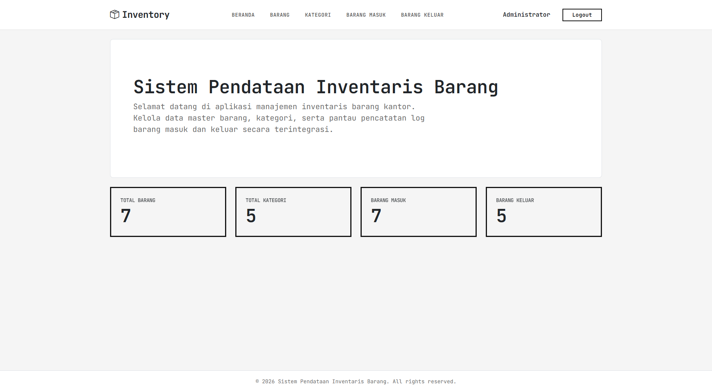
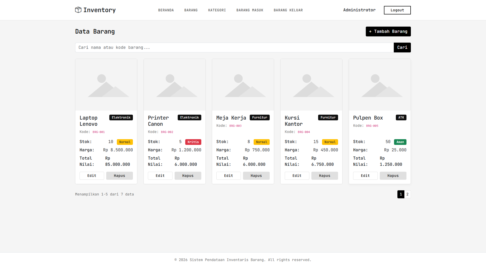
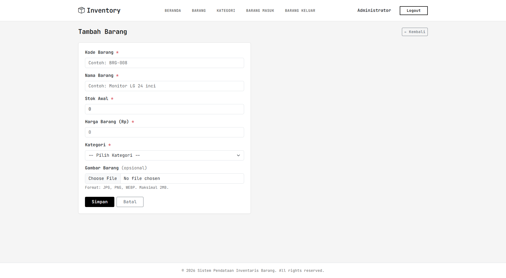
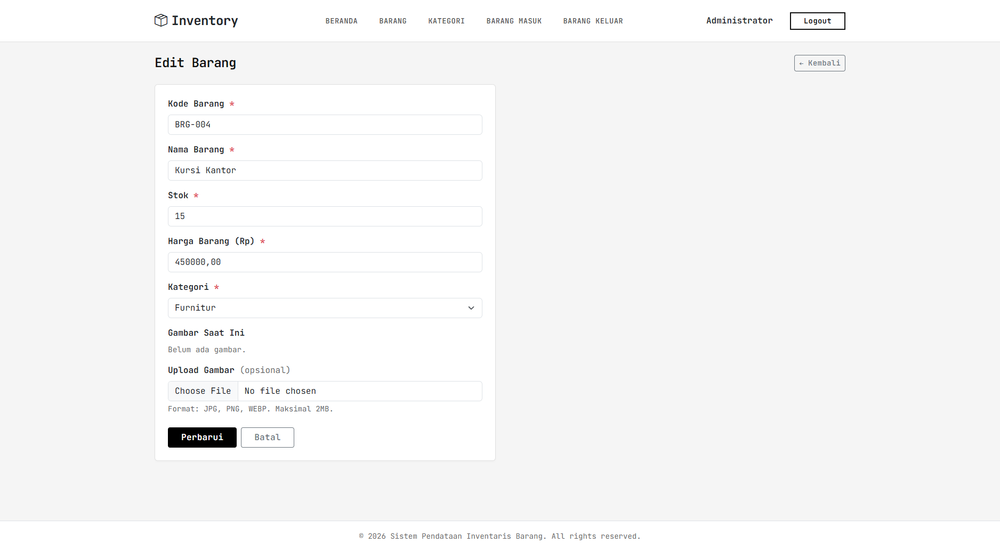
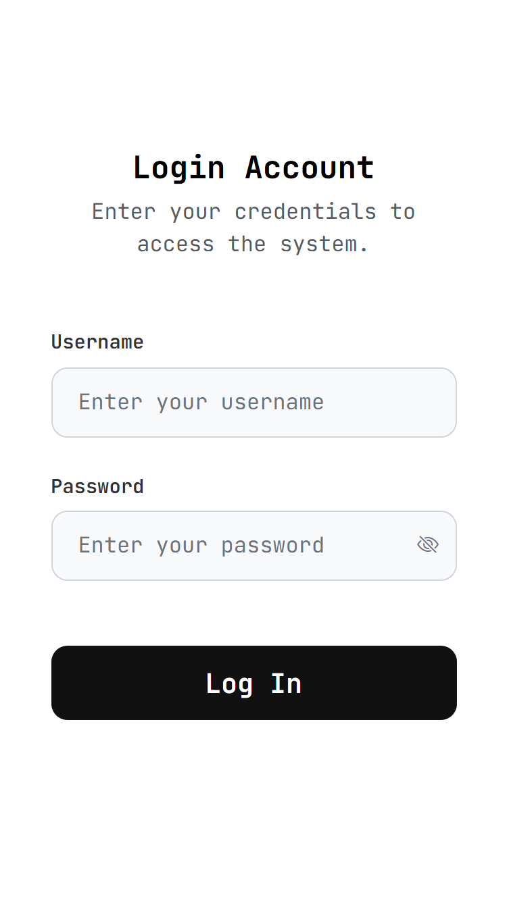

# Sistem Pendataan Inventaris Barang

Aplikasi web PHP untuk manajemen data inventaris barang kantor, termasuk pencatatan barang masuk dan keluar dengan update stok otomatis.

## Fitur
- CRUD Barang, Kategori
- Pencatatan Barang Masuk & Keluar (stok otomatis via trigger database)
- Autentikasi login dengan session
- Tampilan responsif (Bootstrap)

## Teknologi
PHP, MySQL, Bootstrap 5, JavaScript, Laragon

## Cara Menjalankan
1. Clone repository ini ke `C:\laragon\www\`
2. Buat `includes/config.php` (lihat `includes/config.example.php`)
3. Import `database.sql` ke phpMyAdmin
4. Akses via `http://inventaris-barang.test`

## Akun Default
| Username | Password | Role |
|---|---|---|
| admin | admin123 | admin |
| budi | budi123 | staff |

## Screenshot

### 1. Halaman Beranda

### 2. Halaman Daftar Barang (Desktop)

### 3. Form Tambah Barang

### 4. Form Edit Barang

### 5. Tampilan Mobile

